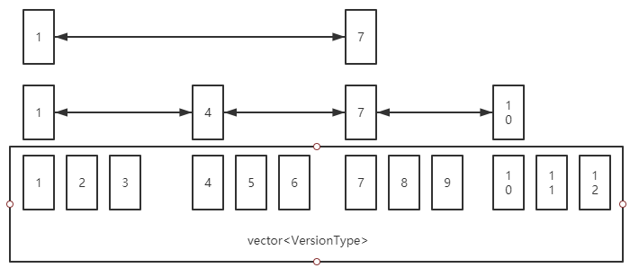
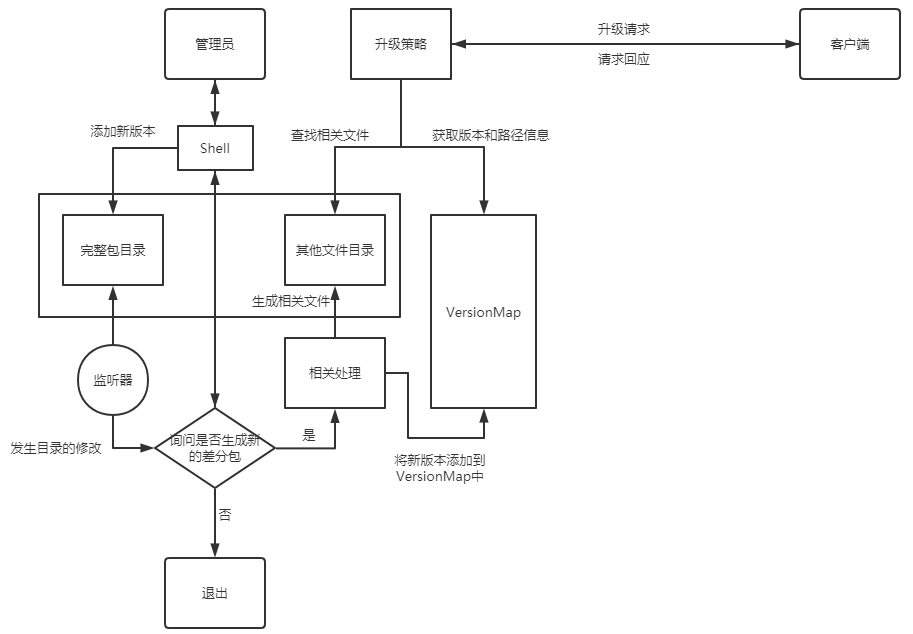

## 技术文档

## Build

### 库依赖

1. bsdiff(已内置) https://github.com/mendsley/bsdiff
2. openssl(环境需配置)
3. merkle(已内置) https://github.com/microsoft/merklecpp

### 编译环境

​	Ubuntu18.04, Ubuntu16.04

​	GCC 9.3.0

## 架构

​	Ubuntu上的OTA升级选用C/S架构，一个专用的服务器负责管理App的所有版本以及对不同客户端的升级请求做出响应。（理论上可以将负责文件存储服务器与负责升级请求的服务器分开）

## 模块

​	OTA差分包的制作以及推送主要分为三大部分

### VersionMap

​	该类为服务器核心数据结构，提供对所有版本的管理以及最短差分路径的查找。

#### 结构实现

​	VersionMap实现为一个逻辑意义上的跳表，其底层数据结构为一个::std::vector，通过一定的算法来构建在逻辑意义上的路径。每一条路径对应着两个个差分包（升级包和回滚包）

​	VersionMap同时还拥有一个供查找的::std::unordered_map。提供了从VersionType到其在底层vector存储的索引的映射。



​	如图所示，跳表的底层是一个vector,每相邻的元素中都有一条路径，上层的逻辑路径由算法得出。

```c++
// 该函数根据长度算出当前的层数
inline constexpr LevelType levelOfDistance(VerDist dist) const noexcept {
    LevelType level = 0;
    if (dist >= 0 && dist < vcm_basic_distance) return level;
    VerIndex l = vcm_basic_distance;
    while (dist >= l) {
        level++;
        l <<= 1;
    }
    return level;
}

// Get the distance value on a certain level.
// 该函数根据层数算出指定层数上路径相对于最底层的距离。(最底层距离为1)
inline constexpr VerDist distanceOfLevel(LevelType level) const noexcept {
    if (level == 0) return 1;

    VerDist distance = vcm_basic_distance;
    LevelType max = level < vcm_max_level ? level : vcm_max_level;
    for (LevelType i = 1; i < max; ++i) distance *= vcm_factor;
    return distance;
}


// VersionMap容量的计算
inline constexpr uint64_t CapacityOfVcm(uint8_t vcm_max_level,
                                        uint8_t vcm_basic_distance,
                                        uint8_t vcm_factor) noexcept {
  if (vcm_max_level == 0) return 1;

  uint64_t capacity = vcm_basic_distance;
  for (uint64_t i = 1; i < vcm_max_level; ++i) capacity *= vcm_factor;
  return capacity;
}

// VersionMap大小的控制
enum class VCM { Large, Mid, Tiny };

// 中等大小的VersionMap
template <VCM vcm = VCM::Mid>
struct VcmControl {
  // Medium size
  using VerDiff = int32_t;
  using VerDist = int32_t;
  using VerIndex = uint32_t;
  using LevelType = uint32_t;

  // It denote the max level that skiplist can build.
  // 此项规定了跳表的最大层数
  inline static constexpr uint8_t vcm_max_level = 9;

  // It denote the distance in the level 1
  // Kvcmbasicdistance should be kept as small as possible and should be a power
  // of 2 or 3.
  // 这表示在第一层(最底层是第零层)的距离，此项应足够小并且应该为2或者3的幂。
  inline static constexpr uint8_t vcm_basic_distance = 3;

  // It must be 2 and can not change due to the lookup algorithm limits.
  // 算法限制此项应为2
  inline static constexpr uint8_t vcm_factor = 2;

  // 编译期计算VersionMap的大小
  inline static constexpr uint64_t vcm_capacity =
      CapacityOfVcm(vcm_max_level, vcm_basic_distance, vcm_factor);
};
```


#### 功能实现

​	服务器对存放所有App版本的目录进行监听，如有新版本加入，则调用Append()函数将新版本纳入VersionMap的管理。此时VersionMap会调用算法检测是否建立新的逻辑路径。每建立一条逻辑路径时，VersionMap会自动调用服务器初始化时已经被设置好了的回调函数进行差分包、新版本的校验码以及差分包签名文件的生成和生成文件的存放。

​	每次当客户端发送升级请求时，服务器将根据策略匹配到的版本号与客户端的版本号作为参数传入VersionMap::search()中进行两个版本间最短升级(回滚)路径的查找。查找算法使用dfs并支持并行查找。查找到最短路径后会返回所有路径，此后相应函数会根据路径查找其路径对应的差分包文件、差分包签名文件以及打完差分补丁后App版本的校验码文件，最后服务器会将所有文件打包好发送给客户端进行OTA升级。

### UpdateStrategy

​	该模块给服务器提供了不同的差分包推送策略。

#### 结构实现

​	升级策略的配置文件为有一定规定的json文件。update_strategy.hpp提供了一系列函数对其进行解析和匹配。

​	下图为一个简单的demo，意思为遇见名字为"app demo" 且 类型为 “demo type”的请求，如果版本小于0.0.5则可选择升级到0.0.5，如果版本大于0.1.0则强制回滚到0.1.0，如果版本大于0.0.5小于0.1.0则可选择回滚到0.0.5.

```json
[
  {
    "name" : "app demo",
    "update" : [
      {
        "strategy" : "optional",
        "condition" : {
          "version" : {
            "compare" : "<",
            "value" : "0.0.5"
          },
        "type" : {
            "assign" : "==",
            "name" : "demo type"
        	},
        "dest" : "0.0.5"
      }
    ],
    "rollback" : [
      {
        "strategy" : "compulsory",
        "condition" : {
          "version" : {
            "compare" : ">",
            "value" : "0.1.0"
          },
          "type" : {
            "assign" : "==",
            "name" : "demo type"
          }
        },
        "dest" : "0.1.0"
      }，
	  {
        "strategy" : "optional",
        "condition" : {
          "version" : {
            "compare" : ">",
            "value" : "0.0.5"
          },
          "type" : {
            "assign" : "==",
            "name" : "demo type"
          }
        },
        "dest" : "0.0.5"
      }
    ]
  }
]
```


#### 功能实现

​	update_strategy.hpp提供了一系列函数对其进行解析和匹配。其解析时提供了一个关键字"newest"。其作用是始终匹配到最新版本。

```json
"newest" = "whatever"
```

​	并且匹配时是按照先后顺序匹配的，最先为关键字“newest”，其次是update，最后是rollback。在update与rollback中遇见的子语句块匹配也是按照先后顺序来进行的。

### Diff.h

​	此模块提供了差分包的生成算法，最核心就是对bsdiff算法的封装，其余便是暴力遍历寻找不同的文件以及增删的文件。为了知道两个版本间文件发生了怎样的变化，所以每次检测到文件的变化（增删改）都会记录下来，在应用差分包时会按照记录来做这些操作。而升级包与回滚包的区别只是redo与undo的区别。

### ota_server 概述

ota_server底层采用的是Linux Epoll IO多路复用用。主要功能是管理完整包和差分包并将对应的差分包传给客户端。其大致流程：

- 首先 `OTAServer` 启动后会进行环境初始化，设置好相应的回调函数并创建好对应的文件夹
- 初始化VersionMap数据结构
- 初始化完整包目录监听器
- 一旦客户端连接到服务器，根据请求的数据内容进行分发处理
    - 第一次处理请求，由服务器解析请求包中源和目的版本号并根据本地策略文件进行目的版本的匹配，最后返回该匹配版本给客户端
    - 第二次处理请求用于验证客户端是否进行升级/回滚。若是，则根据VersionMap在本地版本管理目录中寻找一条合适的差分包路径并生成一个完整的差分包给压缩文件客户端（通过调用回调函数`findPackVCMCallback`）；反之则不进行处理
- 客户端升级完成之后在断开连接

## 技术流程

### 逻辑图



#### 新版本添加的大致流程

1. 管理员将新版本文件复制到完整包目录下（此目录拥有该App的所有版本）。

2. 监听器监听到完整包目录变化，向终端发送信息询问是否根据新版本文件产生差分包。如选择否，则只将该版本纳入VersionMap而不产生差分包。

3. 如果选择是，则调用VersionMap中设置好了的回调函数进行相关文件（差分包文件及其签名文件和新版本的哈希值）的生成。

   ##### 备注

   在生成差分文件的过程中，VersionMap会阻塞掉所有对VersionMap::newest()的调用，以确保不会发生匹配到最新版时缺没有差分补丁的情况。

#### 升级请求的大致流程

1. 客户端发送app信息

2. 服务器根据客户端的信息选定目标版本，然后将相关信息返回给客户端。

3. 如果升级(回滚)是可选的，则让客户端决定是否升级(回滚)，如果客户端拒绝升级(回滚)，则退出流程。

4. 若升级回滚是强制的或客户端决定升级，则客户端会再发一个确认的信息给服务器。

5. 服务器接收到确认信息后会根据确认信息中的"From"、"Destination"域中提取出版本信息并调用VersionMap的search方法进行查找。

6. 服务器会通过search方法查找到的路径信息去找出相应差分包、升级后的版本校验码以及差分包签名，找到所有文件后放入同一目录下打包成.tar.gz发送给客户端。

7. 客户端接收到.tar.gz文件后会将其解压至一临时目录，随后打开apply_log，按照apply_log中存储好了的信息进行逐包升级()：

   ​	① 对差分包进行签名的验证，如验证失败则升级(回滚)失败，返回错误信息以及当前版本号。

   ​	② 验证成功后则解压差分包至一临时路径，调用相关函数进行版本升级(回滚)，若升级失败则返回错误信息和当前版本号。

   ​	③ 升级(回滚)成功后则根据文件目录下的file_log对其记录了的文件求版本的校验码，与.tar.gz中存放的服务器端版本的校验码进行对比，如不一致则返回升级失败相关的提示信息。

8. 升级(回滚)完成。

   

### 技术细节

#### 客户端发送给服务器升级请求的格式

```json
{
  "Request" : "Yes",
  "name" : "app name",
  "version" : "0.0.1",
  "type" : "app type"
}
```

#### 服务器发送给客户端请求回应的格式

```json
{
  "Response" : "Yes",
  "Action" : "Update/Rollback",
  "Strategy" : "Optional/Compulsory",
  "From" : "app version",
  "Destination" : "destination version"
}
```

#### 客户端发送给服务器确认信息的格式

```json
{
  "Confirm" : "Yes",
  "Action" : "Update/Rollback",
  "Strategy" : "Compulsory/Optional",
  "From" : "app version",
  "Destination" : "destination version"
}
```

#### 服务器发送给客户端的数据格式

```
data.tar.gz
|---pack_1.tar.gz
|---pack_1_hash
|---pack_1_sig
|---pack_2.tar.gz
|---pack_2_hash
|---pack_2_sig
|---pack_3.tar.gz
|---pack_3_hash
|---pack_3_sig
|
.
.
.
|---apply_log
备注：apply_log中按行排序好了多包连续升级(回滚)的顺序。

apply_log
./pack_1.tar.gz|./pack_1_hash|./pack_1_sig
./pack_2.tar.gz|./pack_2_hash|./pack_2_sig
./pack_3.tar.gz|./pack_3_hash|./pack_3_sig
...
...
```
